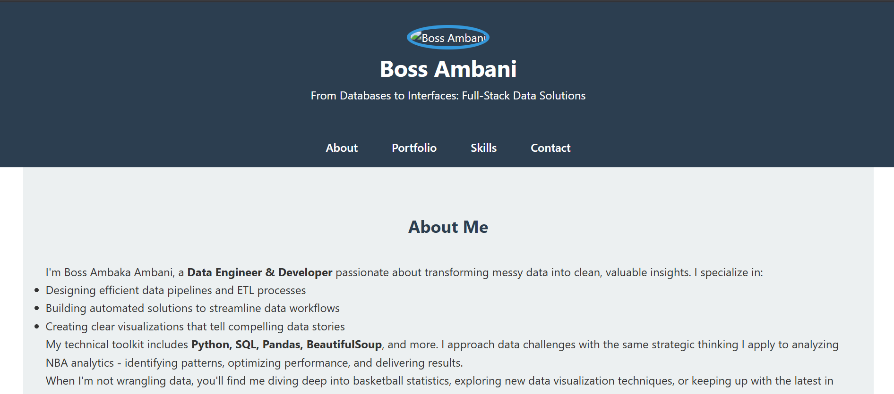

# Personal Portfolio Website



A responsive personal portfolio website showcasing my skills in data engineering, web development, and data analysis.

## Features

- **Clean, modern design** with mobile responsiveness
- **Project showcase** with detailed case studies
- **Interactive contact form** (Formspree integration)
- **Technical skills** display with icons
- **Dark/light** color scheme

## Technologies Used

- **Frontend**: HTML5, CSS3, JavaScript
- **Tools**: 
  - BeautifulSoup (Web Scraping)
  - Pandas (Data Analysis)
  - SQL (Data Cleaning)
- **Hosting**: GitHub Pages/Netlify/Vercel *[specify yours]*

## Projects Showcased

1. **Fortune 500 Companies Scraper**
   - Python web scraping with BeautifulSoup
   - Data cleaning with Pandas
   - CSV export functionality

2. **Layoffs Data Cleaning Project**
   - SQL data standardization
   - Duplicate removal with ROW_NUMBER()
   - Date format conversion

## Setup Instructions

1. Clone the repository:
   ```bash
   git clone https://github.com/bossambani.github.io/your-repo.git
